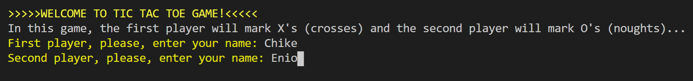
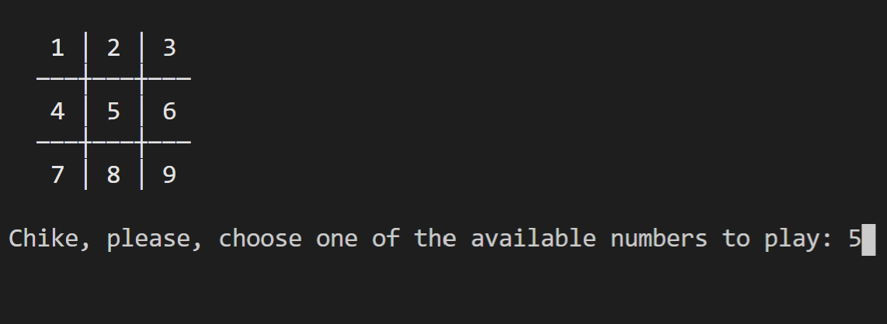
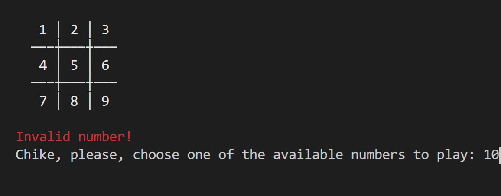
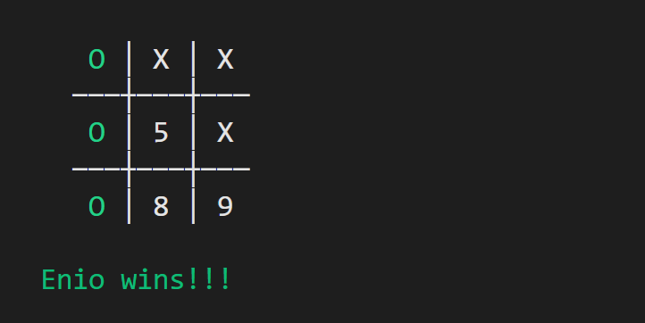
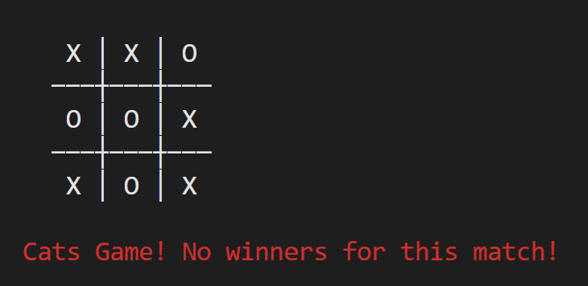

# The TicTacToe Game

Tic-tac-toe (American English), noughts and crosses (Commonwealth English and British English), or Xs and Os/“X’y O’sies” (Ireland), is a paper-and-pencil game for two players, X and O, who take turns marking the spaces in a 3×3 grid. The player who succeeds in placing three of their marks in a diagonal, horizontal, or vertical row is the winner. It is a solved game with a forced draw assuming best play from both players.

# Development Milestones

- Milestone 1: Project setup was performed as described in the requirements.
- Milestone 2: We created the user interface on `bin/main.rb` file for the TicTacToe Game project.
- Milestone 3: We added the game logic in the file `lib/tic_tac_toe.rb`.
- Milestone 4: We added instructions for players to enable them to understand and play the game successfully.

## Built With

- Ruby
- Git flow
- GitHub

### Prerequisites

- Terminal (Bash)
- Git
- Ruby (with colorize gem)

### Setup: How to start the TicTacToe game

- clone our repo: `git clone git@github.com:enionsouza/TicTacToe.git`
- cd into: `cd TicTacToe/bin`
- run `./main.rb`

### How to play the game:

The above command should open the game interface.
- The first player should enter their name
- Thereafter, the second should enter their name, too.

- Then both players should take turns choosing one of the available numbers shown on the screen.

- The app will reject an invalid number and require the player to enter another number from the remaining numbers.

- The player who succeeds in placing three of their marks in a diagonal, horizontal, or vertical row is the winner. However, if there are no remaining numbers to choose and no winner, then it's a tie (a draw game) also called *Cats Game* in TicTacToe.

## Authors

👤 Enio Neves de Souza

- GitHub: [@enionsouza](https://github.com/enionsouza)
- Twitter: [@enionsouza](https://twitter.com/enionsouza)
- LinkedIn: [LinkedIn](https://www.linkedin.com/in/enio-neves-de-souza/)

👤 Chibuike Uzoechina (Original Project)

- GitHub: [@Chike1990](https://github.com/Chike1990)
- Twitter: [@ChibuikeUzoechi](https://twitter.com/ChibuikeUzoechi)
- LinkedIn: [@Chibuike-Uzoechina](https://www.linkedin.com/in/chibuike-uzoechina-630857102)

## 🤝 Contributing

Contributions, issues, and feature requests are welcome!

Feel free to check the [issues page]

## Show your support

Give a ⭐️ if you like this project!

## Acknowledgments

- Many thanks to Microverse
- friends
- our standup team

## 📝 License

This project is [MIT](LICENSE) Licensed.
